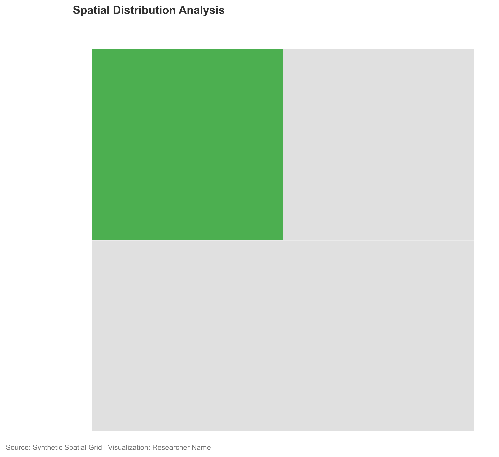
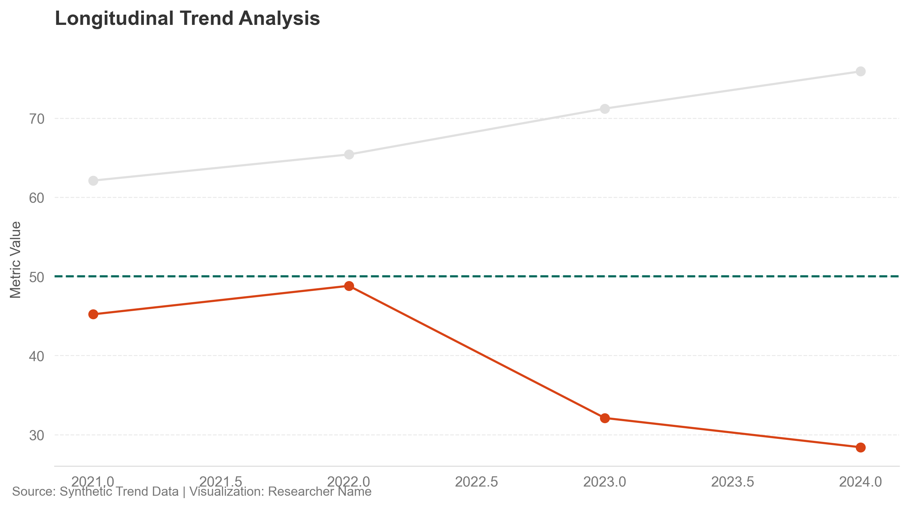

# Spatial Viz Toolkit

[](https://www.python.org/)
[](https://github.com/abrandaojr/spatial-viz-toolkit/actions/workflows/ci.yml)
[](https://geopandas.org/)

Spatial Viz Toolkit is a small, reproducible Python framework for creating
clean geospatial maps and statistical charts with Matplotlib, GeoPandas, and
Pandas.

The project is built around a simple visual rule: use quiet context layers by
default, and reserve color for analytical meaning. It is useful for academic
figures, policy reports, environmental analysis, and spatial workflows where
clarity matters more than decoration.

<p align="center">
  
  
</p>

## What It Includes

- Matplotlib style file for minimalist academic figures
- YAML color palette with semantic base and highlight colors
- Helper functions for map styling, footer attribution, and conditional spatial highlighting
- Spatial and statistical chart templates
- Synthetic sample data for quick local tests
- Optional empirical-data example using public GeoJSON and Gapminder data
- Pre-rendered example outputs

## Design Principles

- Remove nonessential visual noise: redundant borders, axes, grids, and heavy styling
- Use grayscale for context and color only for analytical emphasis
- Keep source and visualization attribution visible in every figure
- Make templates easy to adapt for reproducible research pipelines
- Prefer readable, publication-oriented defaults over dashboard-style decoration

## Repository Layout

```text
data/                         Sample CSV and GeoJSON datasets
outputs/                      Example rendered figures
palettes/colors.yaml          Semantic color palette
themes/academic_minimalist.mplstyle
templates/spatial_analysis_template.py
templates/statistical_charts_template.py
utils/geo_style.py            Shared plotting helpers
generate_figures.py           Generates local synthetic examples
generate_real_public_figures.py
```

## Installation

```powershell
git clone https://github.com/abrandaojr/spatial-viz-toolkit.git
cd spatial-viz-toolkit

python -m venv .venv
.\.venv\Scripts\Activate.ps1
pip install -r requirements.txt
```

GeoPandas depends on geospatial libraries. If installation with `pip` is
difficult on your machine, create the environment with Conda instead:

```powershell
conda create -n spatial-viz-toolkit python=3.11 geopandas matplotlib pandas pyyaml -c conda-forge
conda activate spatial-viz-toolkit
```

## Quick Start

Generate the local synthetic examples:

```powershell
python generate_figures.py
```

This writes:

```text
outputs/spatial_map.png
outputs/trend_chart.png
```

Generate examples from public datasets:

```powershell
python generate_real_public_figures.py
```

This writes:

```text
outputs/real_public_map.png
outputs/real_public_chart.png
```

## Basic Usage

```python
import geopandas as gpd
import matplotlib.pyplot as plt

from utils.geo_style import configure_map, add_footer, plot_minimalist_functional, load_palette

plt.style.use("themes/academic_minimalist.mplstyle")
colors = load_palette("palettes/colors.yaml")

gdf = gpd.read_file("data/sample_regions.geojson")

fig, ax = plt.subplots(figsize=(10, 8))
plot_minimalist_functional(
    gdf=gdf,
    target_column="status",
    target_value="Target Feature",
    highlight_color=colors["highlight"]["primary_positive"],
    ax=ax,
)
configure_map(ax)
add_footer(fig, source="Sample spatial data", author="Researcher Name")
plt.tight_layout()
plt.show()
```

## Data Expectations

Spatial data should be readable by GeoPandas, such as:

- GeoJSON
- Shapefile
- GeoParquet
- GeoPackage

For conditional highlighting, include a categorical column such as `status`,
`category`, `class`, or `region_type`.

Tabular trend data should be in long format, for example:

```text
year,group_id,metric_value,category
2020,A,44,Context
2021,A,47,Context
2022,B,62,Critical Alert
```

## Quality Checks

```powershell
python -m compileall -q generate_figures.py generate_real_public_figures.py templates utils
python generate_figures.py
```

The GitHub Actions workflow runs these checks on every push and pull request.
